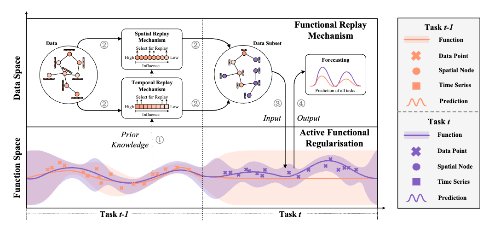

# Exploring the Function-Space for Multi-Modal Incremental Traffic Flow Forecasting (MEMO) 
#### *by: Jianyang Qin, Chaoyang Li, Jinhao Cui, Lingzhi Wang, Yan Jia and Qing Liao*


## Abstract
<p align="center">

</p>

As urban transportation systems expand, continual learning from incremental traffic data is essential for monitoring traffic evolution. In practice, multi-modal incremental traffic exhibits a severe domain shift, being more challenging than uni-modal scenarios. Consequently, existing methods that perform incremental forecasting in parameter or data space potentially yield suboptimal regularisation and replay results, which are more susceptible to catastrophic forgetting under multi-modal scenarios. To address this, we propose a novel Multi-modal incrEMental fOrecasting framework based on function-space inference, named MEMO, which minimizes the function divergence between incremental tasks to achieve effective and efficient incremental learning. Specifically, we first propose an active functional regularisation, conducted in function space rather than parameter or data space, to memorise past knowledge during incremental learning. This regularisation retains a function posterior over specific tasks for optimization, mitigating significant function changes caused by parameter updates. By incorporating a forgetting factor, we empower this regularisation to discard irrelevant knowledge, facilitating the function's adaptation to new tasks. Then, we propose a functional replay mechanism to detect and select spatio-temporal points relevant to the function of previous and current tasks during incremental learning, further aiding in incremental function-space inference. We conduct extensive experiments in both uni-modal and multi-modal incremental scenarios. The results demonstrate the superiority of the proposed method over the state-of-the-art incremental forecasting methods.


## Requirements:
- Python 3.9
- torch == 2.1.0+cu118
- torch-geometric == 2.5.3
- dm-tree == 0.1.8
- Numpy == 1.24.1

## Datasets
You can download the preprocessed datasets from [BaiduYun](https://pan.baidu.com/s/13vP5js2qhPooyjsGtTPI6A?pwd=8jxn).

We used three public datasets in this study:
- LargeST
- UCTB

## Train:
You can train our MEMO by following the steps bellow.

 - Download the datasets and put them in "data/UCTB" folder

 - Run with "python main.py" for UCTB dataset, or "python UCTB.py --conf conf_uctb/memo.json --gpuid 0" for UCTB dataset using GPU device 0

   ```
   python main.py
   ```

   ```
   python main.py --conf conf_uctb/memo.json --gpuid 0
   ```

 - Check the output results (MAE, RMSE, and MAPE). Models are saved to "res_uctb" folder for further use.

